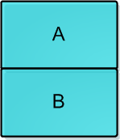
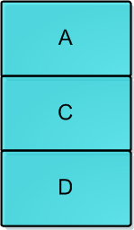

CAS笔记
====  
1关于CAS等原子操作
 * CAS操作——Compare & Set 或是 Compare & Swap，现在几乎所有的CPU指令都支持CAS的原子操作，X86下对应的是 CMPXCHG 汇编指令。有了这个原子操作，我们就可以用其来实现各种无锁（lock free）的数据结构。
 * 这个操作用C语言来描述就是下面这个样子：（代码来自Wikipedia的[Compare And Swap](https://en.wikipedia.org/wiki/Compare-and-swap)词条）意思就是说，看一看内存*reg里的值是不是oldval，如果是的话，则对其赋值newval。  
```c++
 int compare_and_swap (int* reg, int oldval, int newval)
{
    int old_reg_val = *reg;
    if (old_reg_val == oldval)
        *reg = newval;
    return old_reg_val;
}
```
* 这个操作可以变种为返回bool值的形式（返回 bool值的好处在于，可以调用者知道有没有更新成功）：
```c++
bool compare_and_swap (int *accum, int *dest, int newval)
{
  if ( *accum == *dest ) {
      *dest = newval;
      return true;
  }
  return false;
}
```
* 与CAS相似的还有下面的原子操作：（这些东西大家自己看Wikipedia吧）
  * [Fetch And Add](https://en.wikipedia.org/wiki/Fetch-and-add) 一般用来对变量做 +1 的原子操作
  * [Test-and-set](https://en.wikipedia.org/wiki/Test-and-set) 写值到某个内存位置并传回其旧值。汇编指令BST
  * [Test and Test-and-set](https://en.wikipedia.org/wiki/Test_and_test-and-set) 用来低低Test-and-Set的资源争夺情况
* 在实际的C/C++程序中，CAS的各种实现版本如下：
  * GCC的CAS
    * GCC4.1+版本中支持CAS的原子操作（完整的原子操作可参看 [GCC Atomic Builtins](https://gcc.gnu.org/onlinedocs/gcc-4.1.1/gcc/Atomic-Builtins.html)）
``` 
bool __sync_bool_compare_and_swap (type *ptr, type oldval type newval, ...)
type __sync_val_compare_and_swap (type *ptr, type oldval type newval, ...)
```
  * Windows的CAS
    * 在Windows下，你可以使用下面的Windows API来完成CAS：（完整的Windows原子操作可参看MSDN的[InterLocked Functions](http://msdn.microsoft.com/en-us/library/windows/desktop/ms686360(v=vs.85).aspx#interlocked_functions))
```
InterlockedCompareExchange ( __inout LONG volatile *Target, __in LONG Exchange, __in LONG Comperand);
```
  * C++11中的CAS
    * C++11中的STL中的atomic类的函数可以让你跨平台。（完整的C++11的原子操作可参看 [Atomic Operation Library](http://en.cppreference.com/w/cpp/atomic)）
```
template< class T >
bool atomic_compare_exchange_weak( std::atomic<T>* obj,
                                   T* expected, T desired );
template< class T >
bool atomic_compare_exchange_weak( volatile std::atomic<T>* obj,
                                   T* expected, T desired );
```
2 CAS的ABA问题
* CAS看起来很爽，但是会导致“ABA问题”，所谓ABA（见维基百科的[ABA](https://en.wikipedia.org/wiki/ABA_problem)词条），问题基本是这个样子：  
  进程P1在共享变量中读到值为A, P1被抢占了, 进程P2执行, P2把共享变量里的值从A改成了B，再改回到A，此时被P1抢占。P1回来看到共享变量里的值没有被改变，于是继续执行。
* 这个例子你可能没有看懂，维基百科上给了一个活生生的例子:  
  你拿着一个装满钱的手提箱在飞机场，此时过来了一个火辣性感的美女，然后她很暖昧地挑逗着你，并趁你不注意的时候，把用一个一模一样的手提箱和你那装满钱的箱子调了个包，然后就离开了，你看到你的手提箱还在那，于是就提着手提箱去赶飞机去了。
* CAS算法实现一个重要前提需要取出内存中某时刻的数据，而在下时刻比较并替换，那么在这个时间差类会导致数据的变化。
* 在运用CAS做Lock-Free操作中有一个经典的ABA问题：
  - 线程1准备用CAS将变量的值由A替换为B，在此之前，线程2将变量的值由A替换为C，又由C替换为A，然后线程1执行CAS时发现变量的值仍然为A，所以CAS成功。但实际上这时的现场已经和最初不同了，尽管CAS成功，但可能存在潜藏的问题，例如下面的例子：  
      
  - 现有一个用单向链表实现的堆栈，栈顶为A，这时线程T1已经知道A.next为B，然后希望用CAS将栈顶替换为B：  
    `head.compareAndSet(A,B);`  
    在T1执行上面这条指令之前，线程T2介入，将A、B出栈，再pushD、C、A，此时堆栈结构如下图，而对象B此时处于游离状态：  
      
  - 此时轮到线程T1执行CAS操作，检测发现栈顶仍为A，所以CAS成功，栈顶变为B，但实际上B.next为null，所以此时的情况变为：  
      
  - 其中堆栈中只有B一个元素，C和D组成的链表不再存在于堆栈中，平白无故就把C、D丢掉了。  
    以上就是由于ABA问题带来的隐患，各种乐观锁的实现中通常都会用版本戳version来对记录或对象标记，避免并发操作带来的问题。

3 解决ABA的问题
* 使用double-CAS（DCAS双保险的CAS），例如，在32位系统上，我们要检查64位的内容
  * 一次用CAS检查双倍长度的值，前半部是指针，后半部分是一个计数器。
  * 只有这两个都一样，才算通过检查，要吧赋新的值。并把计数器累加1。
* 使用数组来实现队列是很常见的方法，因为没有内存的分部和释放，一切都会变得简单(ring buffer形式的数组 环形数组)