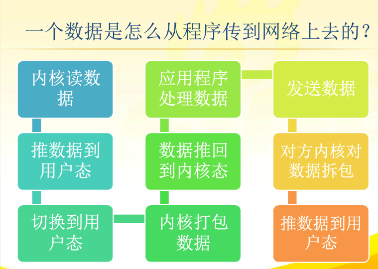

# 深入理解同步/异步与阻塞/非阻塞（sync async & blocking non-blocking）
## 1.前言
* 在网络编程中，阻塞、非阻塞、同步、异步经常被提到。unix网络编程第一卷第六章专门讨论五种不同的IO模型，Stevens讲的非常详细
## 2.数据流向
* 网络IO操作实际过程涉及到内核和调用这个IO操作的进程。以read为例，read的具体操作分为以下两个部分:
  * （1）内核等待数据可读
  * （2）将内核读到的数据拷贝到进程
* 详细过程如下图所示：
   
## 3.同步与异步
* 首先来解释同步和异步的概念，这两个概念与消息的通知机制有关。
  * 举个例子，比如一个用户去银行办理业务，他可以自己去排队办理，也可以叫人代办，办完之后再告知用户结果。对于要办理这个银行业务的人而言，自己去办理是同步方式，而别人代办完毕再告知则是异步方式。
  * 两者的区别在于，同步的方式下，操作者主动完成了这件事情；而异步方式下，调用指令发出后，操作马上就返回了，操作者并不能马上知道结果，而是等待所调用的异步过程（在这个例子中是帮忙代办的人）处理完毕之后，再通过通知手段（在代码中通常是回调函数）来告诉操作者结果。

* 在上图的异步 IO 模型中，应用程序调用完 aio_read 之后，不论是否有数据可读，这个操作都会马上返回，这个过程相当于这个例子中委托另一个人去帮忙代办银行业务的过程，当数据读完拷贝到用户内存之后，会发一个信号通知原进程告诉读数据操作已经完成（而不仅仅是有数据可读）。
## 4.阻塞与非阻塞
* 接着解释阻塞与非阻塞的概念。这两个概念与程序处理事务时的状态有关。
  * 同样用前面的例子，当真正执行办理业务的人去办理银行业务时，前面可能已经有人排队等候。如果这个人一直从排队到办理完毕，中间都没有做过其他的事情，那么这个过程就是阻塞的，这个人当前只在做这么一件事情。

* 在上图中，应用程序发起 recvfrom 操作之后，要等待数据拷贝成功才能返回。整个过程中，不能做其它的操作，这个就是典型的阻塞 IO。反之，如果这个人发现前面排队的人不少，于是选择了出去逛逛，过了一会再回来看看有没有轮到他的号被叫到，如果没有又继续出去逛，过一阵再回来看看……如此以往，这个过程就是非阻塞的。因为处理这个事情的人，在这整个过程中，并没有做到除了这件事之外不做别的事情，他的做法是反复的过来检测，如果还没有完成就下一次再次尝试完成这件事情。

* 上图与前面阻塞 IO 图的区别在于，当没有数据可读时，同样的 recvfrom 操作返回了错误码，表示当前没有可读数据。换言之，即使没有数据也不会一直让这个应用阻塞在这个调用上，这就是非阻塞 IO。
## 5.小结
* 阻塞与非阻塞：区别在于完成一件事情时，当事情还没有完成时，处理这件事情的人除此之外不能再做别的事情；
* 同步与异步：是自己去做这件事情，还是等别人做好了来通知有结果，然后再自己去拿结果。注意这里说的是拿结果，如果只是别人告诉你可以做某事，然后自己**作，这种情况下也是同步的操作，在后面多路复用I/O中会进行阐述。
* 可见，两组概念不是一个维度的概念。我们把需要办理银行业务的人称为 A，把代办理的人称为 B，那么在 A 委托 B 办理业务的情况下，假设 A 在交代 B 帮忙办事之后，A 就去做别的事情，那么 A 并不存在针对办理银行业务这件事情而言是阻塞还是非阻塞，办理事务时阻塞与否，是针对真正需要办理这件事情的人，也就是这个例子里的 B。
## 6.与多路复用 I/O 的联系
* 在以前笔者包括不少同行的理解中，就这个例子而言，列举下面情况，当去办理业务的人，需要排队时通常都会先去取号，拿到一个纸条的号码，然后等待银行叫号。在那个例子里面，曾经将银行叫号理解成 select 操作，把纸条比作向 select 注册的回调函数，一旦可以进行操作的条件满足，就会根据这个回调函数来通知办理人，然后办理人再去完成工作，因此 select 等多路复用操作是异步的行为。

但上面这种理解最大的错误在于，同步与异步的区别在于是不是要求办理者自己来完成，所有需要自己完成的操作都是同步操作，不管是注册了一个回调（这里的叫号小纸条）等待回调你，还是自己一直阻塞等待。

在上例中，虽然对需要办理业务的人而言，通过叫号小纸条，他可以等待银行的办理通知。等待的同时可以去别的事情，比如浏览手机上网，但只要可以办理该业务的条件满足，真正叫到号可以办理业务时，办理者是需要自己去完成办理的。

换言之，在完成一件事情时，需要区分处理两种状态：一是这个事情是不是可以做了（条件满足的消息，如 select 告诉你某个文件描述符可读），另外一个是否完成了这件事情（如调用 read/write 完成 IO 操作）。多路复用 IO 记录下来有哪些人在等待消息的通知，在条件满足时负责通知办理者，而完成这件事情还是需要办理者自己去完成。只要是自己去完成的操作，都是同步的操作。

