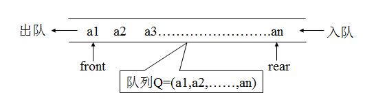
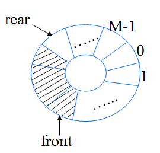
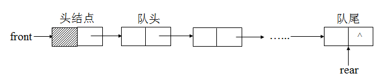
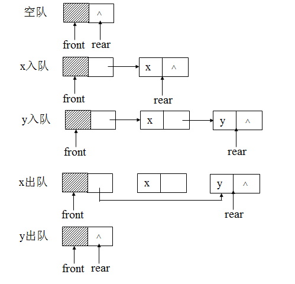

Queue学习笔记
====  
1.队列是什么
----
* 队列是一种可以实现“先进先出”(FIFO)的存储结构。  
    
* 队首(front) ：允许进行删除的一端称为队首
* 队尾(rear) ：允许进行插入的一端称为队尾。
* 队列通常可以分为三种类型：
  * ①静态数组队列（由数组实现），静态队列通常都必须是循环队列。
  * ②链式队列（由链表实现）。
  * ③动态数组队列
* 队列应有下面几个操作:
  * InitQueue（）　　   ——初始化队列
  * EnQueue（）        ——进队列
  * DeQueue（）        ——出队列
  * IsQueueEmpty（）   ——判断队列是否为空
  * IsQueueFull（）    ——判断队列是否已满

2.队列的表示和实现
----
* 静态数组队列（循环数组队列实现）  
    
```c++
循环队列可以更简单防止伪溢出的发生，但队列大小是固定的。  
/* 队列的顺序存储结构(循环队列) */  
#define MAX_QSIZE 5 /* 最大队列长度+1 */  
typedef struct  
{  
  QElemType *base; /* 初始化的动态分配存储空间 */  
  int front; /* <span style="color:#ff0000;">头指针，若队列不空，指向队列头元素</span> */  
  int rear;  /* <span style="color:#cc0000;">尾指针，若队列不空，指向队列尾元素的下一个位置</span> */  
}SqQueue;  
   
/* 循环队列的基本操作(9个) */  
void InitQueue(SqQueue *Q)  
{ /* 构造一个空队列Q */  
  Q->base=malloc(MAX_QSIZE*sizeof(QElemType));  
  if(!Q->base) /* 存储分配失败 */  
    exit(OVERFLOW);  
  Q->front=Q->rear=0;/*空队列*/  
}  
   
void DestroyQueue(SqQueue *Q)  
{ /* 销毁队列Q，Q不再存在 */  
  if(Q->base)  
    free(Q->base);  
  Q->base=NULL;  
  Q->front=Q->rear=0;  
}  
   
void ClearQueue(SqQueue *Q)  
{ /* 将Q清为空队列 */  
  Q->front=Q->rear=0;  
}  
   
Status QueueEmpty(SqQueue Q)  
{ /* 若队列Q为空队列，则返回TRUE；否则返回FALSE */  
  if(Q.front==Q.rear) /* 队列空的标志 */  
    return TRUE;  
  else  
    return FALSE;  
}  
   
int QueueLength(SqQueue Q)  
{ /* 返回Q的元素个数，即队列的长度 */  
  return(Q.rear-Q.front+MAX_QSIZE)%MAX_QSIZE;  
}  
   
Status GetHead(SqQueue Q,QElemType *e)  
{ /* 若队列不空，则用e返回Q的队头元素，并返回OK；否则返回ERROR */  
  if(Q.front==Q.rear) /* 队列空 */  
    return ERROR;  
  *e=Q.base[Q.front];  
  return OK;  
}  
   
Status EnQueue(SqQueue *Q,QElemType e)  
{ /* 插入元素e为Q的新的队尾元素 */  
  if((Q->rear+1)%MAX_QSIZE==Q->front) /* 队列满 */  
    return ERROR;  
  Q->base[Q->rear]=e;  
  Q->rear=(Q->rear+1)%MAX_QSIZE;  
  return OK;  
}  
   
Status DeQueue(SqQueue *Q,QElemType *e)  
{ /* 若队列不空，则删除Q的队头元素，用e返回其值，并返回OK；否则返回ERROR */  
  if(Q->front==Q->rear) /* 队列空 */  
    return ERROR;  
  *e=Q->base[Q->front];  
  Q->front=(Q->front+1)%MAX_QSIZE;  
  return OK;  
}  
   
void QueueTraverse(SqQueue Q,void(*vi)(QElemType))  
{ /* 从队头到队尾依次对队列Q中每个元素调用函数vi() */  
  int i;  
  i=Q.front;  
  while(i!=Q.rear)  
  {  
    vi(Q.base[i]);  
    i=(i+1)%MAX_QSIZE;  
  }  
  printf("\n");  
}  
```
* 链式队列  
    
    
```c++
单链队列  
单链队列使用链表作为基本数据结果，所以不存在伪溢出的问题，队列长度也没有限制。但插入和读取的时间代价较高  
/* 单链队列——队列的链式存储结构 */  
typedef struct QNode  
{  
  QElemType data;  
  struct QNode *next;  
}QNode,*QueuePtr;  
   
typedef struct  
{  
  QueuePtr front,rear; /* 队头、队尾指针 */  
}LinkQueue;  
   
/* 链队列的基本操作(9个) */  
void InitQueue(LinkQueue *Q)  
{ /* 构造一个空队列Q */  
  Q->front=Q->rear=malloc(sizeof(QNode));  
  if(!Q->front)  
    exit(OVERFLOW);  
  Q->front->next=NULL;  
}  
   
void DestroyQueue(LinkQueue *Q)  
{ /* 销毁队列Q(无论空否均可) */  
  while(Q->front)  
  {  
    Q->rear=Q->front->next;  
    free(Q->front);  
    Q->front=Q->rear;  
  }  
}  
   
void ClearQueue(LinkQueue *Q)  
{ /* 将Q清为空队列 */  
  QueuePtr p,q;  
  Q->rear=Q->front;  
  p=Q->front->next;  
  Q->front->next=NULL;  
  while(p)  
  {  
    q=p;  
    p=p->next;  
    free(q);  
  }  
}  
   
Status QueueEmpty(LinkQueue Q)  
{ /* 若Q为空队列，则返回TRUE，否则返回FALSE */  
  if(Q.front->next==NULL)  
    return TRUE;  
  else  
    return FALSE;  
}  
   
int QueueLength(LinkQueue Q)  
{ /* 求队列的长度 */  
  int i=0;  
  QueuePtr p;  
  p=Q.front;  
  while(Q.rear!=p)  
  {  
    i++;  
    p=p->next;  
  }  
  return i;  
}  
   
Status GetHead_Q(LinkQueue Q,QElemType *e)  
{ /* 若队列不空，则用e返回Q的队头元素，并返回OK，否则返回ERROR */  
  QueuePtr p;  
  if(Q.front==Q.rear)  
    return ERROR;  
  p=Q.front->next;  
  *e=p->data;  
  return OK;  
}  
   
void EnQueue(LinkQueue *Q,QElemType e)  
{ /* 插入元素e为Q的新的队尾元素 */  
  QueuePtr p=malloc(sizeof(QNode));  
  if(!p) /* 存储分配失败 */  
    exit(OVERFLOW);  
  p->data=e;  
  p->next=NULL;  
  Q->rear->next=p;  
  Q->rear=p;  
}  
   
Status DeQueue(LinkQueue *Q,QElemType *e)  
{ /* 若队列不空，删除Q的队头元素，用e返回其值，并返回OK，否则返回ERROR */  
  QueuePtr p;  
  if(Q->front==Q->rear)  
    return ERROR;  
  p=Q->front->next;  
  *e=p->data;  
  Q->front->next=p->next;  
  if(Q->rear==p)  
    Q->rear=Q->front;  
  free(p);  
  return OK;  
}  
   
void QueueTraverse(LinkQueue Q,void(*vi)(QElemType))  
{ /* 从队头到队尾依次对队列Q中每个元素调用函数vi() */  
  QueuePtr p;  
  p=Q.front->next;  
  while(p)  
  {  
    vi(p->data);  
    p=p->next;  
  }  
  printf("\n");  
}  
```
3.队列进阶
----
* 无锁队列
* 等待队列


参考文档 [std::queue](http://www.cplusplus.com/reference/queue/queue/)  
参考博客 [blog1](http://blog.csdn.net/leichelle/article/details/7546775) [blog2](http://yangzhizhen.iteye.com/blog/1472348) [blog3](http://blog.csdn.net/luoweifu/article/details/8507835) 

